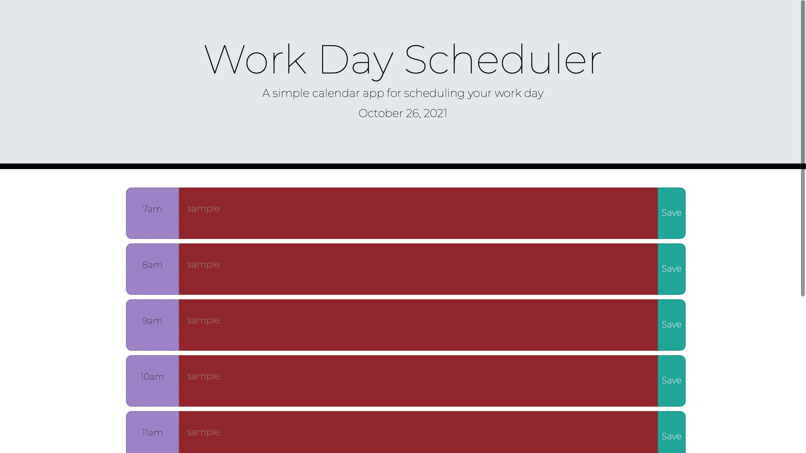

# scheduledtowork

For this assignment I built a simple daily planner that is able to save user input as well as switch color based on the time of the day.

The technologies used in this assingment were as follows:

- HTML
- CSS
- Javascript

The requirments were:

- GIVEN I am using a daily planner to create a schedule
- WHEN I open the planner
  THEN the current day is displayed at the top of the calendar
- WHEN I scroll down
  THEN I am presented with timeblocks for standard business hours
- WHEN I view the timeblocks for that day
  THEN each timeblock is color coded to indicate whether it is in the past, present, or future
- WHEN I click into a timeblock
  THEN I can enter an event
- WHEN I click the save button for that timeblock
  THEN the text for that event is saved in local storage
- WHEN I refresh the page
  THEN the saved events persist
- The main challenges I faced during this assingment was getting the textbox to switch to the appropriate color based on the time of the day.

I was able to successfully create local storage for all textboxes in the scheduler, have the color of the textbox change based on the time of the day as well as have the current date display in the header.

This assignment helped me gain a better understanding of the power of APIs and why they can be helpful in creating/building relevent and useful applications.

